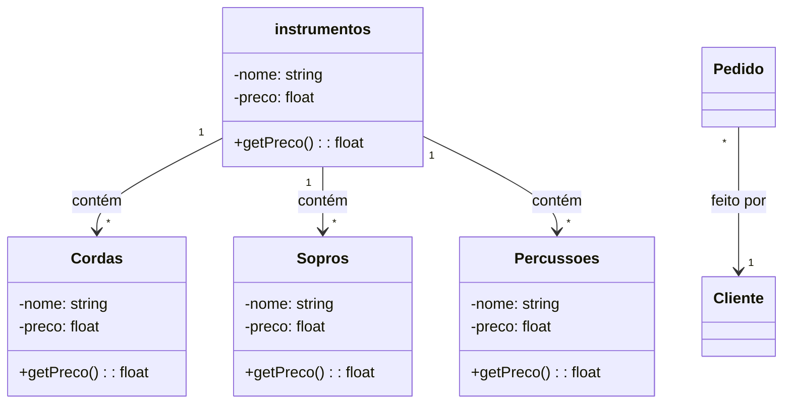

```mermaid
classDiagram
  class instrumentos {
     -nome: string
    -preco: float
    +getPreco(): float
  }

  class Cordas {
   -nome: string
    -preco: float
    +getPreco(): float
}

 class Sopros {
   -nome: string
    -preco: float
    +getPreco(): float
}

 class Percussoes {
   -nome: string
    -preco: float
    +getPreco(): float
}

instrumentos "1" --> "*" Cordas : contém
instrumentos "1" --> "*" Sopros : contém
instrumentos "1" --> "*" Percussoes : contém
  Pedido "*" --> "1" Cliente : feito por
```
