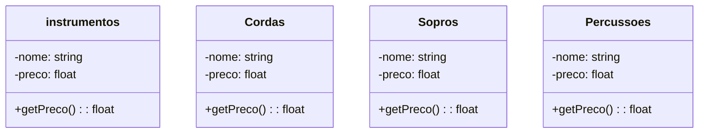

```mermaid
classDiagram
  class instrumentos {
     -nome: string
    -preco: float
    +getPreco(): float
  }

  class Cordas {
   -nome: string
    -preco: float
    +getPreco(): float
}

 class Sopros {
   -nome: string
    -preco: float
    +getPreco(): float
}

 class Percussoes {
   -nome: string
    -preco: float
    +getPreco(): float
}
```
