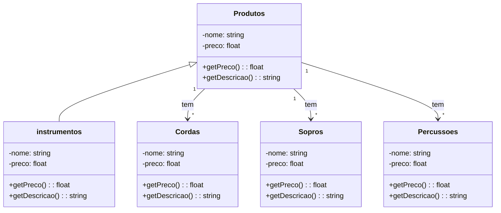

```mermaid
classDiagram
  class Produtos {
     -nome: string
    -preco: float
    +getPreco(): float
    +getDescricao(): string
  }

class instrumentos {
   -nome: string
    -preco: float
    +getPreco(): float
    +getDescricao(): string
}


  class Cordas {
   -nome: string
    -preco: float
    +getPreco(): float
    +getDescricao(): string
}

 class Sopros {
   -nome: string
    -preco: float
    +getPreco(): float
    +getDescricao(): string
}

 class Percussoes {
   -nome: string
    -preco: float
    +getPreco(): float
    +getDescricao(): string
}
Produtos  <|-- instrumentos
Produtos "1" --> "*" Cordas : tem
Produtos "1" --> "*" Sopros : tem
Produtos "1" --> "*" Percussoes : tem
```
