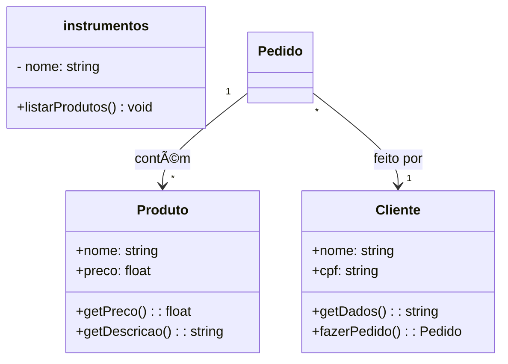

```mermaid
classDiagram
  class instrumentos {
    - nome: string
    +listarProdutos() void
  }

  class Cliente {
    +nome: string
    +cpf: string
    +getDados(): string
    +fazerPedido(): Pedido
  }

  class Produto {
    +nome: string
    +preco: float
    +getPreco(): float
    +getDescricao(): string
  }

  Pedido "1" --> "*" Produto : contém
  Pedido "*" --> "1" Cliente : feito por
```
